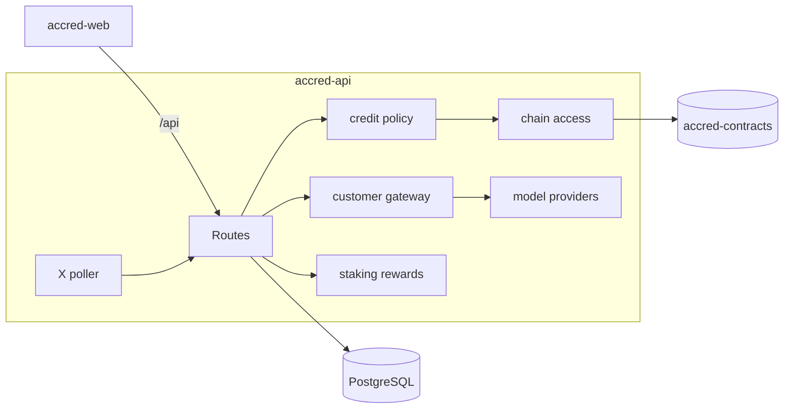

# accred-api

Backend for [Accred](https://github.com/useAccred/accred): Express 5 API, credit engine, price oracle, router and settlement, metered customer gateway, staking rewards and the X assistant.



## Layout

```text
artifacts/api-server/   Express app (routes/, lib/, skills/)
lib/db/                 Drizzle schema and client
lib/api-spec/           openapi.yaml + Orval config
lib/api-zod/            Generated Zod validators
docs/                   API, Customer API, X bot, configuration, deployment, credits
```

## Quick start

```bash
pnpm install
cp .env.example .env        # fill in values
pnpm --filter @workspace/db run push
pnpm --filter @workspace/api-server run dev
```

| Command | Description |
| --- | --- |
| `pnpm run typecheck` | Type check libs and server |
| `pnpm --filter @workspace/api-server run build` | Bundle to `dist/` |
| `pnpm --filter @workspace/api-spec run codegen` | Regenerate validators from OpenAPI |
| `cd artifacts/api-server && node --import tsx --test "src/lib/*.test.mjs"` | Unit tests |

## Documentation

[HTTP API](docs/API.md) · [Customer API](docs/CUSTOMER_API.md) · [X assistant](docs/X_BOT.md) · [Configuration](docs/CONFIGURATION.md) · [Deployment](docs/DEPLOYMENT.md) · [Credit economics](docs/CREDITS.md)

## License

MIT © 2026 Accred
