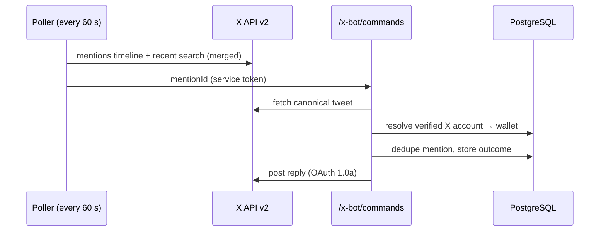

# X assistant

`@useAccred` answers read-only questions about the **tweet author's own** linked wallet.

## Commands

Write the command word right after the handle:

| Command | Reply |
| --- | --- |
| `@useAccred balance` | Credit balance |
| `@useAccred usage` | Recent API usage |
| `@useAccred cashback` | Cashback earned |
| `@useAccred swaps` | Recent swaps |
| `@useAccred keys` | API key count |
| `@useAccred status` | Account status |
| `@useAccred stats` | Protocol statistics |
| `@useAccred help` | Command list |

Replies are sent only when a command word directly follows the handle. `buy`, `sell`, `send` and `swap` are rejected: the bot holds no signing keys and cannot move funds.

## Linking

Settings → Connect X (requires a verified wallet). A link is permanent for the wallet and cannot be removed from the UI.

## Pipeline

- Only the tweet ID crosses the poller boundary; author and text are re-fetched from X.
- Mentions are deduplicated in PostgreSQL; a mention with an uncertain post outcome is never re-posted.
- History from before the first run is skipped.
- Polling and posting are enabled with `X_BOT_POLLING_ENABLED=true` and `X_BOT_POSTING_ENABLED=true`; missing configuration fails closed and reports variable names only.
